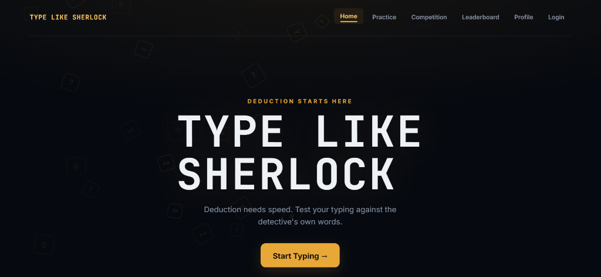
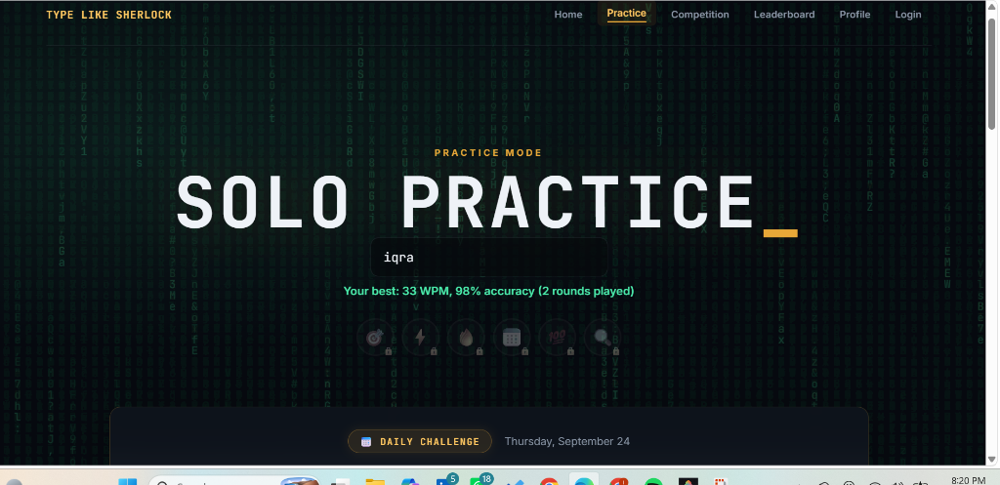
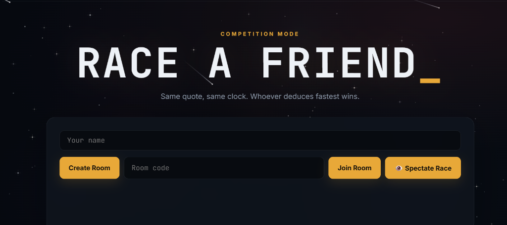
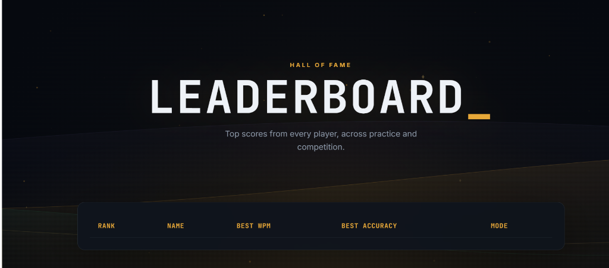
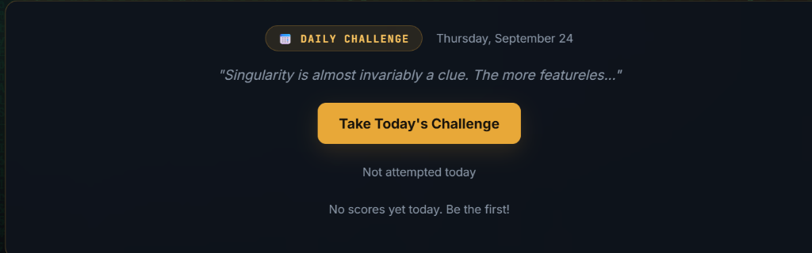

<](https://nodejs.org/)
[](https://expressjs.com/)
[](https://socket.io/)
[](https://www.mongodb.com/)
[](https://developer.mozilla.org/en-US/docs/Web/JavaScript)

A full-stack, Sherlock Holmes–themed typing speed game featuring solo practice with adaptive difficulty, real-time multiplayer races, a global leaderboard, achievement badges, daily challenges, and much more — all wrapped in a cinematic dark-green design system with premium canvas animations.

[Live Demo](#) · [Report Bug](https://github.com/iqraAnsar271/typing-master-/issues) · [Request Feature](https://github.com/iqraAnsar271/typing-master-/issues)

</div>

---

## 📸 Screenshots

> **Replace the placeholders below with your own screenshots or GIFs.**

| Home | Practice Mode |
|:----:|:-------------:|
|  |  |

| Competition Mode | Leaderboard |
|:----------------:|:-----------:|
|  |  |

| Daily Challenge | Profile & Achievements |
|:---------------:|:----------------------:|
|  |  |

---

## ✨ Features

### Core Gameplay

- **Solo Practice Mode** — Type quotes from Sherlock Holmes (and other themes) with real-time WPM, accuracy, and streak tracking
- **3 Difficulty Levels** — Easy, Medium, and Hard with progressively longer and more complex quotes
- **Adaptive Difficulty** — The game automatically promotes or demotes your difficulty level based on your WPM and accuracy performance
- **Per-Player Best Scores** — Your personal best is saved locally and displayed before each round
- **Real-Time Multiplayer** — Create or join a private room with a 4-character code, get a synced 3-2-1 countdown, and race against opponents typing the same quote on a 60-second timer
- **Live Opponent Progress** — See your competitor's typing progress update in real time during a race
- **Global Leaderboard** — Server-side persistent leaderboard ranking top scores across all players and modes

### Advanced Features

- **🏅 Achievement Badges** — Earn badges like *Perfect Round*, *Speed Demon*, *Streak Master*, *Century Club*, and the ultimate *The Sherlock* award, with toast notifications on unlock
- **📅 Daily Challenge** — A unique quote every day (deterministic, same for all players), with daily streak tracking and a dedicated leaderboard
- **🎹 Keyboard Accuracy Heatmap** — Visual QWERTY heatmap that tracks your per-key accuracy over time, highlighting weak spots in red
- **⏪ Typing Replay** — Record and play back your typing sessions keystroke-by-keystroke at the original pace, with adjustable speed
- **📦 Quote Packs** — Switch between themed quote collections: 🔍 Sherlock Holmes, 🚀 Sci-Fi, and 🎬 Movies
- **🖼️ Social Share Cards** — Generate a beautiful canvas-rendered result card with your WPM, accuracy, and avatar for sharing on social media
- **⌨️ Virtual Keyboard** — On-screen responsive QWERTY keyboard for touch-device users, with next-key highlighting
- **👀 Spectator Mode** — Watch a simulated live race between iconic Sherlock Holmes characters with real-time progress bars and a race feed ticker
- **🎨 Premium Canvas Animations** — Unique, page-specific animated backgrounds: floating typewriter elements on Home, a code matrix on Practice, velocity streams on Competition, and luminous aurora waves on Leaderboard
- **👤 User Profile** — Customizable avatar and display name, with full stats history

### 🚧 Coming Soon

- **User Accounts (Signup / Login)** — JWT-based authentication with persistent profiles stored in MongoDB
- **Admin Panel** — Manage quotes, view registered users, and moderate leaderboard entries
- **User Dashboard** — Personal stats overview with recent scores and progress tracking

---

## 🛠️ Tech Stack

| Layer        | Technology                                                                                   |
|:-------------|:---------------------------------------------------------------------------------------------|
| **Frontend** | HTML5, CSS3 (Vanilla), JavaScript (ES6+), Canvas API                                        |
| **Backend**  | [Node.js](https://nodejs.org/), [Express](https://expressjs.com/)                           |
| **Real-Time**| [Socket.io](https://socket.io/)                                                              |
| **Database** | [MongoDB](https://www.mongodb.com/) with [Mongoose](https://mongoosejs.com/) ODM            |
| **Auth**     | [JSON Web Tokens](https://jwt.io/) (JWT), [bcrypt.js](https://github.com/dcodeIO/bcrypt.js) |
| **Fonts**    | [Inter](https://fonts.google.com/specimen/Inter), [JetBrains Mono](https://fonts.google.com/specimen/JetBrains+Mono) via Google Fonts |
| **Design**   | Dark green / black design system, glassmorphism cards, monospace headings                    |

---

## 📂 Project Structure

```
typing-game/
├── index.html              # Home page — hero & navigation
├── practice.html           # Solo practice mode
├── competition.html        # Real-time multiplayer race
├── leaderboard.html        # Global leaderboard
├── login.html              # Authentication (signup & login)
├── dashboard.html          # User dashboard (stats overview)
├── profile.html            # User profile & avatar customization
├── admin.html              # Admin panel
│
├── style.css               # Global stylesheet & design system
├── script.js               # Core typing game engine & adaptive difficulty
├── multiplayer.js           # Socket.io multiplayer client logic
├── auth.js                 # Client-side authentication helpers
├── achievements.js         # Badge system & toast notifications
├── daily-challenge.js      # Daily challenge engine & streak tracking
├── heatmap.js              # Keyboard accuracy heatmap renderer
├── replay.js               # Keystroke replay engine
├── quote-packs.js          # Themed quote collections (Sherlock, Sci-Fi, Movies)
├── share-card.js           # Canvas-based social share card generator
├── virtual-keyboard.js     # On-screen touch keyboard
├── spectator.js            # Spectator mode (simulated live race)
├── bg-animations.js        # Premium per-page canvas background animations
├── dashboard.js            # Dashboard data & rendering
├── profile.js              # Profile page logic & avatar management
├── admin.js                # Admin panel client logic
│
├── server/
│   ├── server.js           # Express + Socket.io server entry point
│   ├── package.json        # Server dependencies
│   ├── .env                # Environment variables (PORT, MONGO_URI, JWT_SECRET)
│   ├── leaderboard.js      # Leaderboard utilities
│   ├── models/
│   │   ├── User.js         # Mongoose User schema
│   │   └── Score.js        # Mongoose Score schema
│   ├── routes/
│   │   ├── authRoutes.js   # Authentication API endpoints
│   │   ├── gameRoutes.js   # Game & leaderboard API endpoints
│   │   └── adminRoutes.js  # Admin API endpoints
│   └── middleware/
│       └── authMiddleware.js  # JWT verification middleware
│
└── README.md
```

---

## 🚀 Getting Started

### Prerequisites

- [Node.js](https://nodejs.org/) v18 or higher
- [MongoDB](https://www.mongodb.com/try/download/community) running locally (or a MongoDB Atlas connection string)

### Installation

1. **Clone the repository**

   ```bash
   git clone https://github.com/iqraAnsar271/typing-master-.git
   cd typing-master-
   ```

2. **Install server dependencies**

   ```bash
   cd server
   npm install
   ```

3. **Configure environment variables**

   The `server/.env` file comes pre-configured for local development:

   ```env
   PORT=5000
   MONGO_URI=mongodb://127.0.0.1:27017/typing-game
   JWT_SECRET=typelikesherlock_secret_key_2026
   ```

   > Update `MONGO_URI` if you're using MongoDB Atlas, and change `JWT_SECRET` to a strong random string for production.

4. **Start the server**

   ```bash
   node server.js
   ```

   You should see:
   ```
   MongoDB connected
   Server running on port 5000
   ```

5. **Open in your browser**

   ```
   http://localhost:5000
   ```

---

## 🎮 How to Play

### Solo Practice

1. Navigate to the **Practice** page
2. Enter your name and (optionally) pick a quote pack theme
3. Click **Start** — a Sherlock Holmes quote appears
4. Type each word and press `Space` to advance; correct words turn green, mistakes turn red
5. At the end of the quote you'll see your **WPM**, **accuracy**, and **streak** count
6. Hit your targets and the game will automatically bump you to a harder difficulty

### Multiplayer Competition

1. Navigate to the **Competition** page
2. Enter your name
3. **Create** a room to get a 4-character room code, or **Join** with a friend's code
4. Once two or more players are in, a **3-2-1 countdown** begins
5. Everyone types the same quote simultaneously — watch your opponent's progress bar in real time
6. The first to finish (or the furthest along when the 60-second timer expires) wins

### Daily Challenge

- A new quote is featured every day (same for all players worldwide)
- Complete it to build your daily streak — unlock the **7-Day Streak** badge!

---

## 🗺️ Future Improvements

- 🔊 **Sound Effects** — Keystroke audio feedback, countdown beeps, and victory fanfares
- 🔄 **Rematch Button** — Instant rematch without leaving the competition room
- 🕵️ **Detective-Style Round-End Messages** — Thematic commentary from Sherlock based on your performance
- 📊 **Detailed Analytics** — Historical WPM/accuracy graphs and per-session breakdowns
- 🏆 **Seasonal Tournaments** — Time-limited competitive events with exclusive badges
- 🌍 **Deployable to the Cloud** — One-click deploy to Vercel / Railway / Render

---

## 🤝 Contributing

Contributions, issues, and feature requests are welcome!

1. Fork the repository
2. Create your feature branch (`git checkout -b feature/amazing-feature`)
3. Commit your changes (`git commit -m "Add amazing feature"`)
4. Push to the branch (`git push origin feature/amazing-feature`)
5. Open a Pull Request

---

## 📄 License

This project is open source and available under the [MIT License](LICENSE).

---

<div align="center">

Built with ☕ and 🔍 by [**Iqra Ansar**](https://github.com/iqraAnsar271)

*"The game is afoot."* — Sherlock Holmes

</div>
]]>
